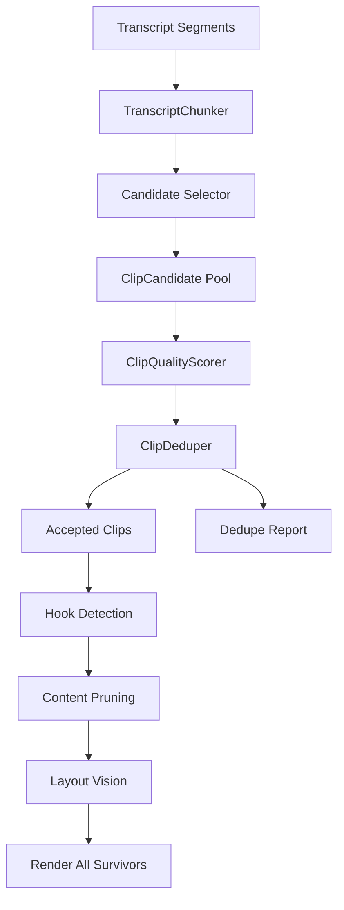

# Exhaustive Distinct Clips Specification

## One-Line Goal

Add an Afterform mode that produces every distinct, non-redundant, quality-clearing short from a source video, without an arbitrary output cap.

## Current Runtime Evidence

The current long-to-shorts pipeline is:

```text
ingest -> clip selection -> hook detection -> content pruning -> layout planning -> render
```

Stage 2 currently uses a fixed candidate pool, local ranking, a minimum kept floor, and a maximum kept cap. The current default config is:

| Setting | Current Default | File |
|---|---:|---|
| `clip_selection_candidate_count` | `12` | `src/afterform/config.py` |
| `clip_selection_quality_threshold` | `0.70` | `src/afterform/config.py` |
| `clip_selection_min_kept` | `5` | `src/afterform/config.py` |
| `clip_selection_max_kept` | `8` | `src/afterform/config.py` |

The ranker enforces the cap after thresholding and backfill. The prompt asks for exactly the configured candidate count and requires no overlap inside that one returned pool.

## Product Definition

"No limits" must not mean "render every possible time window." It means:

> Generate all distinct clips that pass the quality policy, then render all survivors unless the user chooses review-only mode.

The output count is discovered from the source. A weak 45-minute source may produce 3 shorts. A dense 2-hour source may produce 40.

## User Requirements

| ID | User | Need | Acceptance Proof |
|---|---|---|---|
| UR-001 | Creator | Produce more than the curated cap when the source contains many good clips | A fixture with 12 strong candidates keeps all 12 in exhaustive mode |
| UR-002 | Creator | Avoid duplicate or redundant shorts | Duplicate report shows lower-scoring overlaps and same-hook clips removed |
| UR-003 | Operator | Keep curated mode behavior stable | Existing clip-ranking tests still pass |
| UR-004 | Operator | Inspect why clips survived or were dropped | `clip_selection_dedupe.json` explains each keep/drop decision |
| UR-005 | Operator | Run locally without enterprise services | Unit tests and offline fixtures cover selection, scoring, and dedupe |

## Functional Requirements

| ID | Requirement | Priority | Acceptance Proof |
|---|---|---|---|
| FR-001 | Add `ClipSelectionMode` with `curated` and `exhaustive` | must | Config and CLI parse both values |
| FR-002 | In `curated`, preserve existing floor/cap behavior | must | Current ranking tests pass unchanged |
| FR-003 | In `exhaustive`, do not apply `max_kept` after quality filtering | must | Test keeps all quality-clearing candidates |
| FR-004 | In `exhaustive`, do not backfill weak clips by default | must | Low-score candidates are dropped unless review output is requested |
| FR-005 | Generate candidates in transcript chunks for long sources | should | Fixture proves candidates from multiple chunks are merged |
| FR-006 | Deduplicate by time overlap, text similarity, hook similarity, and containment | must | Dedicated dedupe tests cover each rule |
| FR-007 | Persist accepted, rejected, duplicate, and needs-review candidates | should | `clip_selection_dedupe.json` is written |
| FR-008 | Allow review-only operation before rendering | should | CLI can stop after clip selection with exhaustive artifacts |
| FR-009 | Cache must invalidate when mode or dedupe policy changes | must | Cache policy fingerprint includes mode and dedupe version |

## Non-Goals

- Do not solve visual-context clip selection in this feature.
- Do not add a new database.
- Do not require paid enterprise APIs.
- Do not train a neural model before deterministic and classical baselines are tested.
- Do not delete existing curated mode.

## Architecture



## Components

| Component | Responsibility | Owns | Must Not Own |
|---|---|---|---|
| `TranscriptChunker` | Split transcript into model-sized windows with boundary overlap | chunk IDs, source ranges | scoring or rendering |
| `ClipCandidateSelector` | Produce raw candidates per chunk | LLM prompt call or local heuristic call | final quality decision |
| `ClipQualityScorer` | Normalize rule scores into `virality_score` | scoring weights, review flags | dedupe decisions |
| `ClipDeduper` | Remove redundant candidates | overlap, text, hook, containment rules | model calls |
| `ClipSelectionArtifacts` | Persist raw pool, kept clips, dedupe report, policy metadata | JSON artifact paths | business ranking rules |
| `ClipSelectionPolicy` | Describe curated vs exhaustive behavior | thresholds, floor, cap, dedupe settings | transcript parsing |

## Enums

| Enum | Values | Meaning | Default |
|---|---|---|---|
| `ClipSelectionMode` | `curated`, `exhaustive` | Selection policy family | `curated` |
| `DuplicateReason` | `time_overlap`, `text_similarity`, `hook_similarity`, `topic_similarity`, `contained_window` | Why one candidate was dropped | n/a |
| `CandidateSource` | `llm_chunk`, `cached_raw`, `heuristic_window`, `synthetic_fixture` | Where a candidate came from | n/a |
| `RenderDisposition` | `render`, `review_only`, `drop` | Downstream action after dedupe | `render` |

## Data Definitions

| Object | Field | Type | Required | Source | Notes |
|---|---|---|---|---|---|
| `ClipSelectionPolicy` | `mode` | `ClipSelectionMode` | yes | config/CLI | `exhaustive` disables arbitrary final cap |
| `ClipSelectionPolicy` | `quality_threshold` | `float` | yes | config/CLI | default `0.70` |
| `ClipSelectionPolicy` | `min_kept` | `int` | yes | config/CLI | used in curated mode |
| `ClipSelectionPolicy` | `max_kept` | `int | None` | yes | config/CLI | `None` means no arbitrary cap |
| `ClipSelectionPolicy` | `dedupe_policy_version` | `int` | yes | code | cache-significant |
| `ClipCandidate` | `source_chunk_id` | `str | None` | no | chunker | helps debug chunked selection |
| `ClipCandidate` | `source` | `CandidateSource` | yes | selector | distinguishes live, cached, heuristic, synthetic |
| `DedupeDecision` | `kept_clip_id` | `str` | yes | deduper | winner |
| `DedupeDecision` | `dropped_clip_id` | `str` | yes | deduper | redundant loser |
| `DedupeDecision` | `reason` | `DuplicateReason` | yes | deduper | explains removal |
| `DedupeDecision` | `score_delta` | `float` | yes | deduper | winner score minus loser score |

## Converter Classes

| Class | Converts From | Converts To | Rules | Failure Cases |
|---|---|---|---|---|
| `RawCandidateToClipConverter` | LLM `_ClipSelectionCandidate` | `Clip` | validate duration, derive composite score | invalid schema, invalid timestamps |
| `ClipToCandidateFeatureConverter` | `Clip` + transcript | `CandidateFeatures` | normalize text, hook, topic, time span | missing transcript text |
| `DedupeDecisionToJsonConverter` | `DedupeDecision` | JSON artifact | stable ordering by kept/dropped ID | unknown duplicate reason |
| `PolicyToCacheFingerprintConverter` | `ClipSelectionPolicy` | SHA-256 input | include mode, thresholds, dedupe version, rule weights | missing policy field |

## Dedupe Rules

| Rule ID | Condition | Action | Exception | Proof |
|---|---|---|---|---|
| D-001 | Intersection-over-union of source windows >= `0.60` | keep better candidate | keep both if topics differ and hooks differ strongly | unit test |
| D-002 | One window contains another and transcript similarity >= `0.80` | prefer higher score, then tighter duration | prefer longer if tighter clip lacks setup | unit test |
| D-003 | Normalized hook text similarity >= `0.88` | keep higher hook score | keep both if source windows are far apart and examples differ | unit test |
| D-004 | Transcript text similarity >= `0.82` | keep higher composite score | keep both if one is follow-up with distinct payoff | unit test |
| D-005 | Same topic and same named entities with close timestamps | keep higher self-contained score | keep both if arcs are sequential and non-overlapping | unit test |

## ML Strategy

### Baselines

| Approach | Tradeoffs | Recommendation |
|---|---|---|
| Existing LLM prompt with `max_kept=None` | smallest change, but still limited by one fixed candidate count | implement only as v0 shim |
| Chunked LLM candidate generation | finds more clips, simple to fit current pipeline, costs more calls | best first production path |
| Deterministic transcript windows + ML scorer | exhaustive coverage, locally runnable, requires labels or synthetic data | build after chunked mode fixtures exist |
| XGBoost or logistic ranker over transcript features | fast, local, inspectable, good for practical ranking | use when real/synthetic labels exist |
| 7B local LLM scorer | flexible, heavier local resource needs, harder to calibrate | defer until hardware and quality justify it |
| Embedding clustering for dedupe | strong semantic dedupe, but adds model dependency | optional adapter after deterministic dedupe |

### Adjacent-Field Grounding

The dedupe design should borrow from adjacent fields, not invent from scratch:

- Large text-corpus cleaning uses MinHash and locality-sensitive hashing to remove near-duplicate documents at scale. That maps to transcript-window dedupe when many candidate clips share most words.
- Copyright and UGC platforms use reference matching and fingerprinting, such as YouTube Content ID, to compare uploads against known assets. That maps to future visual/audio duplicate detection, but it is too heavy for the first local implementation.
- Classical text retrieval uses TF-IDF vectorization to turn raw text into numeric features. That maps to cheap local transcript similarity and candidate features.
- Gradient-boosted trees, including XGBoost, support practical local ranking/classification without requiring a 7B model. That maps to a future local scorer after enough labeled or synthetic examples exist.

Sources:

- [DataTrove MinHash near-duplicate deduplication](https://deepwiki.com/huggingface/datatrove/5.1-minhash-near-duplicate-deduplication)
- [YouTube Help: Using Content ID](https://support.google.com/youtube/answer/3244015?hl=en)
- [scikit-learn TfidfVectorizer documentation](https://scikit-learn.org/stable/modules/generated/sklearn.feature_extraction.text.TfidfVectorizer.html)
- [XGBoost documentation](https://xgboost.readthedocs.io/)

### Local-First Plan

Start with deterministic dedupe plus LLM candidate generation because it is compatible with the existing pipeline. Add a classical scorer later if enough labeled examples exist.

Minimum local features for future XGBoost/logistic scorer:

- hook length
- first-sentence punctuation and number presence
- named entity count
- source position percentile
- duration
- transcript density
- question/claim markers
- chart-reference keywords
- self-contained pronoun ratio
- repetition/filler ratio

### Synthetic Data Tactic

Create `data/synthetic/clip_selection_edge_cases.jsonl`.

Generation loop:

1. Append generated edge cases to the file.
2. Prompt the LLM with the file contents or sampled hashes.
3. Instruct it to avoid generating cases already present.
4. Include edge types not limited to: overlapping hooks, nested windows, same claim with different setup, weak clips with high named entities, high hooks with low self-contained score, duplicated transcript text across chapters.
5. Use synthetic cases for unit tests and scorer pretraining only.
6. Never treat synthetic scores as ground truth for final product quality.

## Local Hardware Constraint

Known from environment variables:

- OS: Windows
- architecture: AMD64
- logical processors: 16
- processor identifier: AMD Family 25 Model 80

Unknown because WMI access was denied:

- RAM
- GPU
- VRAM

Design implication: the first implementation must run with CPU-only deterministic dedupe and provider-backed LLM calls. Local ML must be optional and bounded. No 7B local model should be required until hardware is confirmed.

## Observability

Add structured logs and artifacts:

| Artifact | Purpose |
|---|---|
| `clip_selection_raw.json` | raw LLM candidate pool |
| `clip_selection_chunks.json` | chunk ranges and model calls |
| `clip_selection_dedupe.json` | keep/drop decisions |
| `clips.meta.json` | cache policy fingerprint |
| `inspect_clip-selection.json` | operator-facing inspection |

Metrics:

- candidate count by chunk
- accepted count
- dropped duplicate count
- dropped low-quality count
- average score
- render disposition count
- model retries
- cache hit/rerank/new-call status

## Resilience And Reliability

- If a chunk LLM call fails, retry with existing `_retry_llm` policy.
- If a chunk repeatedly fails, mark that chunk failed and continue only when `allow_partial_exhaustive=True`.
- If all chunks fail, fail the stage.
- If dedupe artifact cannot be written, fail before render.
- If `max_kept=None`, downstream render must display the final count before rendering.
- Cache fingerprint must include selection mode and dedupe policy version.

## Presentation Workflow

Add a clean manual simulation path:

```powershell
uv run afterform run long-to-shorts "<url>" --clip-mode exhaustive --stop-after clip-selection --inspect-stage clip-selection
```

Expected presentation artifacts:

- `clips.json`: accepted clips
- `clip_selection_dedupe.json`: rejected duplicates and reasons
- `inspect_clip-selection.json`: single tired-readable summary

This lets Bryan approve the discovered clip set before spending render time.

## API And CLI

CLI additions:

| Flag | Meaning |
|---|---|
| `--clip-mode curated|exhaustive` | choose selection policy |
| `--max-clips N|none` | optional override; `none` maps to `None` |
| `--review-only-clips` | write artifacts and stop before hook/prune/layout/render |

Config additions:

```python
clip_selection_mode: Literal["curated", "exhaustive"] = "curated"
clip_selection_max_kept: int | None = 8
clip_selection_dedupe_policy_version: int = 1
clip_selection_chunk_sec: float = 900.0
clip_selection_chunk_overlap_sec: float = 120.0
```

## Implementation Plan

1. Fix the rerank bug in `flow.py`: use `threshold=` instead of `quality_threshold=` when calling `rank_and_filter_clips`.
2. Add `ClipSelectionMode`.
3. Make `rank_and_filter_clips` accept `max_kept: int | None`.
4. Preserve curated behavior with existing defaults.
5. Add exhaustive behavior: no backfill by default and no final cap.
6. Add `dedupe_clips`.
7. Add `clip_selection_dedupe.json`.
8. Add CLI flags.
9. Update cache policy.
10. Update docs and tests.

## Test Plan

| Test | Type | Proves |
|---|---|---|
| `test_curated_mode_preserves_cap` | unit | existing behavior stable |
| `test_exhaustive_mode_keeps_all_above_threshold` | unit | no arbitrary cap |
| `test_exhaustive_mode_drops_low_quality_without_backfill` | unit | no weak padding |
| `test_dedupe_drops_high_overlap_lower_score` | unit | time dedupe |
| `test_dedupe_drops_same_hook` | unit | hook dedupe |
| `test_dedupe_prefers_tighter_contained_clip_when_scores_close` | unit | containment dedupe |
| `test_cache_policy_includes_mode_and_dedupe_version` | unit | cache correctness |
| `test_cli_accepts_clip_mode_exhaustive` | component | operator UX |

## Gap Analysis

| Gap | Category | Options | Recommendation |
|---|---|---|---|
| Arbitrary max cap | product behavior | keep cap, nullable cap, mode-specific cap | add `exhaustive` mode with nullable cap |
| One fixed candidate pool | recall | increase count, chunk transcript, deterministic windows | chunk transcript first |
| Duplicate definition vague | quality | time only, text only, multi-signal dedupe | multi-signal deterministic dedupe |
| No review artifact | presentation | logs only, JSON report, dashboard | JSON report now |
| Local ML undefined | ML | LLM only, XGBoost, local 7B | LLM candidates + deterministic dedupe now; XGBoost later |
| Hardware unknown | resource | require GPU, CPU-only path, cloud-only | CPU-only deterministic path |
| Visual context missing | multimodal | leave as-is, add pre-selection visual summary | defer to separate visual context feature |

## Open Questions

| Question | Owner | Needed Before |
|---|---|---|
| What is the actual `{target_goal_link}`? | Bryan | final scope approval |
| What are confirmed RAM/GPU/VRAM specs? | Bryan | local ML model choice |
| Which unlimited model should generate synthetic data? | Bryan | synthetic data pipeline |
| Should exhaustive mode render immediately or default to review-only? | Bryan | CLI default decision |

## Definition Of Done

- `curated` mode is behavior-compatible with current tests.
- `exhaustive` mode keeps all distinct candidates above threshold.
- Duplicate and redundant drops are explainable in `clip_selection_dedupe.json`.
- No enterprise API is required.
- The feature has unit tests for ranking, dedupe, cache, and CLI.
- The manual presentation path works without rendering all clips first.
